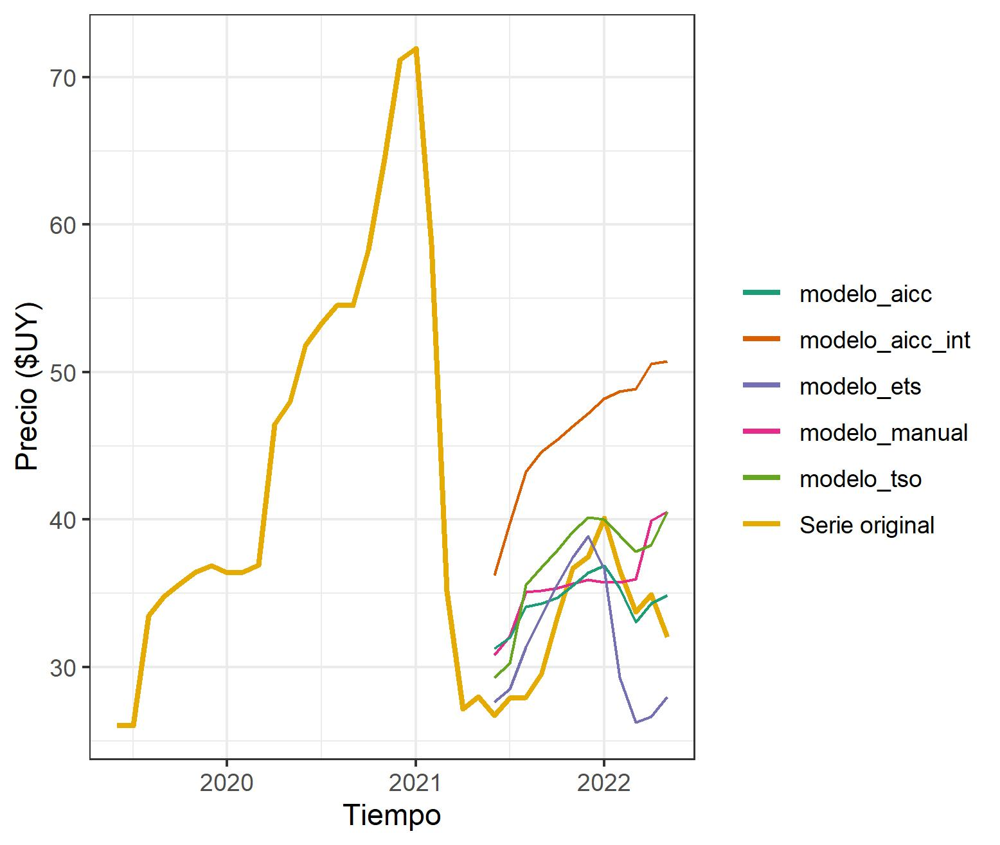

```{r setup, include=FALSE}
knitr::opts_chunk$set(
  echo = FALSE,
  include = FALSE,
  warning = FALSE,
  out.width = '80%',
  fig.align="center")
```

```{r libs}
library(forecast)
library(dplyr)
library(ggplot2)
library(readr)
library(gridExtra)
library(tsoutliers)
library(urca)
library(lmtest)
library(TSA)
library(xtable)
library(ggspectra)

```

```{r datos}
precios_manzana <- read_csv("precios_uam_long.csv")  %>% 
  filter(producto == "Manzana")

# Se pasa a formato ts
manzana <- ts(precios_manzana$precio_promedio, start = c(2013, 1), end = c(2022, 5) , frequency = 12)

manzana_train <- window(manzana, end = c(2021, 5))
manzana_test <- window(manzana, start = c(2021, 6))

```


# Introducción

## Introducción

* Se modeliza la serie de precios mensuales mayoristas del kilo de manzana en la Unidad Agroalimentaria Metropolitana (ex Mercado Modelo).

* Se cuentan con los datos desde enero de 2013 a mayo de 2022 y se considerará el promedio mensual de los precios, por lo que se cuenta con 113 observaciones.

* Datos originales bisemanales, se opta por la frecuencia mensual debido a la dificultad de emplear las herramientas de modelado SARIMA para tales tipos de series.

* Interés especial en la predicción.

# Análisis descriptivo

##

```{r plot_precios, fig.cap="\\label{plot_precios}Serie de precios mensuales del Kg de manzana en pesos uruguayos.", include=TRUE}
autoplot(manzana) +
  theme_bw() +
  labs(x = "Tiempo (Años)",  y = "Precio promedio ($UY por Kg)")
```


##

```{r plot_precios_seas, fig.cap="\\label{plot_precios_seas}Serie de precios mensuales del Kg de manzana en pesos Uruguayos.", include = TRUE}
a <- ggseasonplot(manzana) +
  theme_bw() +
  labs(x = "Tiempo (Mes)",  y = "Precio promedio ($UY por Kg)", title = NULL, color = "Año")

b <- ggsubseriesplot(manzana) +
  theme_bw() +
  labs(x = "Tiempo (Mes)",  y = "Precio promedio ($UY por Kg)")


grid.arrange(a, b, nrow = 1)
```

##

* Marcada estacionalidad anual

* En los últimos 5 años, ciclo corto que se repite cada 2 años.

* Se realizó además la descomposición de la serie en tendencia/ciclo, estacionalidad y componente irregular. 

* Fuerza de la estacionalidad, definida como en [@hyndman2018]:

$$F_s = max\left(0, 1-\frac{Var(R_t)}{Var(R_t+ S_t)}\right) = 0.51$$


# Metodología y resultados

## Metodología

* Se divide la serie original en muestras de entrenamiento y test:
  * Muestra de entrenamiento hasta mayo de 2021, 101 observaciones
  * Muestra de testeo entre junio de 2021 y mayo de 2022, 12 observaciones.

## Identificación manual de un modelo

* Estructura de autocorrelación

* Cantidad de parámetros con los que contará la especificación

* Posible diferenciación de la serie

* Posible transformación

## Estructura de autocorrelaciones

Buscamos identificar la estructura de dependencia temporal de la serie mediante mediante las ACF y PACF muestrales. 

```{r acf1, fig.cap="\\label{acf1}Funciones de autocorrelación y autocorrelación parcial muestrales de la serie de precios de manzana.", include = TRUE}
acf1 <- ggAcf(manzana_train, type = "correlation", plot = FALSE, lag = 72) 
plot_acf1 <- autoplot(acf1) +
  labs(title = NULL) +
  theme_bw()

# Parecería que hay un decaimiento exponencial, pero en torno al lag 24 (2 años) vuelven a 
# haber autocorrelaciones significativas

# Autocorrelación parcial, serie original
pacf1 <- ggAcf(manzana_train, type = "partial", plot = FALSE,lag = 72)
plot_pacf1 <- autoplot(pacf1) +
  labs(title = NULL) +
  theme_bw()

grid.arrange(plot_acf1, plot_pacf1)
```


<!-- ## Dominio de las frecuencias -->

<!-- Desde la perspectiva del dominio de las frecuencias de la serie se considera esta última en su expresión trigonométrica, mediante una suma ponderada de funciones periódicas coseno y seno. El espectro poblacional puede resultar de utilidad para observar la estructura de variabilidad de la serie, dado que el área por debajo del mismo es la variabilidad asociada a las frecuencias consideradas. -->

<!-- En la \autoref{espectro} se presenta la estimación no paramétrica del espectro poblacional de la serie de precios de manzana (izquierda) y las diferencias de los precios de manzana (derecha). En estas estimaciones se hace uso del periodograma muestral, que es la estimación del espectro poblacional a partir de las autocovarianzas muestrales y luego se realiza un promedio ponderado de sus valores mediante un _kernel_ a fines de suavizar el resultado, que en general resulta difícil de interpretar inicialmente. En este caso se pondera con el _kernel_ de Daniell modificado ponderando de a 3 valores del periodograma muestral 2 veces sucesivas. -->

<!-- Se puede apreciar para ambos casos como las frecuencias menores, aquellas asociadas a periodos más largos (teniendo en cuenta que $p =2\pi/w$, siendo $p$ el periodo y $w$ la frecuencia) son aquellas que acumulan mayor variabilidad. Esto puede considerarse como otro indicio de una dependencia temporal estacional entre las observaciones de la muestra. También es posible apreciar como la primera diferencia, que puede ser vista como un filtro que se aplica a la serie, afecta la forma del espectro. Si bien las menores frecuencias siguen siendo las más acentuadas, mediante la aplicación de este filtro el espectro se ve acentuado en torno a las frecuencias 1, 2 y 3.  -->

```{r espectro, include = TRUE, fig.show="hold", fig.cap="\\label{espectro}Periodograma muestral, estimación no paramétrica. 3 spans aplicados 2 veces.", out.width="80%"}
# Estimación del espectro.
# Al agregar spans se está considerando la estimación no paramétrica.
# spec <- spectrum(manzana_train,  spans = c(3, 3), ci.col=NULL, plot = FALSE)
# spec_dif <- spectrum(diff(manzana_train),  spans = c(3, 3), ci.col=NULL, plot = FALSE)
# 
# par(mfrow = c(1,2))
# plot(spec, main = "", xlab = "Frecuencia", ci.col=NULL, ylab = "Estimación del espectro")
# plot(spec_dif, main = "", xlab = "Frecuencia", ylab = "Estimación del espectro", ci.col=NULL)
```


## Tests de raíces unitarias

* Dado que las funciones de autocorrelación dieron indicios de que el proceso no es estacionario, resulta de interés poner a prueba si el proceso es $I(1)$, es decir, si cuenta con una raíz unitaria. En dicho caso el proceso sería no estacionario la cual implicaría que no puede ser modelado en el marco de los ARMA. 

* Utilizamos el test de Dickey-Fuller y el de Phillips-Perron.

  * Hipótesis nula: la serie cuenta con una raíz unitaria
  
  * Ambos tests llevan a no rechazar la hipótesis a un nivel de significación de 95%.

<!-- En el caso del primero se especifica el proceso proceso estocástico subyacente como: -->

<!-- $$Y_t = \rho Y_{t-1} + \varepsilon_t, \,\,\,\, \varepsilon_t \stackrel{\text{iid}}{\sim} N(0, \sigma^2)$$ -->

<!-- y se contrasta $H_0) \rho = 1$ vs $H_1) \rho < 1 \\$. Empleamos el estadístico $(\hat{\rho} - 1) / \sigma_{\hat{\rho}}$, que si $\rho$ es menor a 1 en valor absoluto se distribuye normal asintóticamente y si es igual a 1 debe usarse una distribución empírica tabulada por Fuller. El test además toma en cuenta la posible autocorrelación de los errores incluyendo rezagos de la variable en la regresión auxiliar para mayor robustez. -->

<!-- Por otro lado la propuesta de prueba de raíz unitaria de Phillip-Perron se basa en la de Dickey y Fuller, pero además los compatibilizan con la presencia de heteroscedasticidad y/o autocorrelación de los errores. -->

<!-- Para la serie planteada, al observar los p-valores, ambos tests llevan a no rechazar la hipótesis de raíz unitaria al 95% de confianza. Esto lleva a concluir que una primera diferencia resulta necesaria para llevar la serie a la estacionariedad. -->

##

```{r, fig.cap="\\label{plot_precios}Serie de precios mensuales del Kg de manzana con una diferencia regular, en pesos uruguayos.", include=TRUE}
autoplot(diff(manzana)) +
  theme_bw() +
  labs(x = "Tiempo (Años)",  y = "Precio promedio ($UY por Kg)")
```

##

```{r acf2, include = TRUE, fig.cap= "\\label{acf2}Autocorrelograma y autocorrelograma parcial de la serie de primeras difernecias de precios de manzana."}
manzana_train_diff <- diff(manzana_train)

acf1_diff <- ggAcf(manzana_train_diff, type = "correlation", plot = FALSE, lag = 72) 
plot_acf1_diff <- autoplot(acf1_diff) +
  labs(title = NULL) +
  theme_bw()

# Autocorrelación parcial, serie diferenciada
pacf1_diff <- ggAcf(manzana_train_diff, type = "partial", plot = FALSE,lag = 72)
plot_pacf1_diff <- autoplot(pacf1_diff) +
  labs(title = NULL) +
  theme_bw()

grid.arrange(plot_acf1_diff, plot_pacf1_diff)
```

## Especificación manual del modelo

* La primer autocorrelación resulta significativamente distinta de 0, indicio de un componente MA de primer orden.

* Los para valores en torno a los lags 24 y 48 también lo son, indicio de dependencia estacional autorregresiva de orden 2.

* Solo los dos primeros valores de la autocorrelación parcial son significativos, indicio de una estructura AR de orden 2.


Teniendo en cuenta este acercamiento metodológico, inicialmente se plantea un modelo $ARIMA(2,1,1)(2,0,0)$

## Selección mediante criterios de información

Alternativamente especificamos un modelo mediante el Criterio de Información de Akaike corregido (AICc), mediante la función _auto.arima()_. Su fórmula para un determinado modelo es:

$$AICc = T \log{\hat{\sigma}^2_{MV}} + T \frac{1+k/T}{1-(k+2)/T}$$

* $T$ el número de observaciones

* $k$ el número de parámetros 

* $\hat{\sigma}^2_{MV}$ el estimador MLE de la varianza de los errores.

El modelo seleccionado es aquel con el menor valor del AICc, lo cual a nivel algorítmico se hace empleando la selección _stepwise_ a partir de un conjunto inicial de modelos [@hyndman2018].

El modelo seleccionado mediante esta metodología resulta en un $ARIMA(0,1,2)(0,0,2)$.

## Estimación

* Luego de haber identificado la especificación de los modelos, estimamos sus parámetros por máxima verosimilitud.

* Para esto es necesario asumir que los errores son gaussianos.

* El supuesto anterior es fuerte pero las estimaciones resultantes serán razonables aunque el supuesto no se cumpla [@hamilton_1994].

* En particular, el método empleado es la estimación máximo verosímil condicional, donde se supone que la primera observación de la serie es determinística y se maximiza la verosimilitud condicionada a dicha observación. Esto simplifica las expresiones de las funciones, y si el tamaño de muestra es razonablemente grande, la primera observación no tendrá gran efecto sobre la verosimilitud estimada. 


## Pruebas de significación de los parámetros

Para completar la especificación se realizan pruebas de hipótesis sobre la significación de los parámetros estimados. La hipótesis para cada uno de ellos, siendo $\lambda$ un parámetro cualquiera del modelo:

$$H_0) \lambda = 0$$
$$H_1)\lambda \ne 0$$
Donde el estadístico empleado es:

$$z = \hat{\lambda} / \hat{\sigma}_{\lambda}$$
Para el que se cumplirá la Normalidad asintótica debido a que la estimación se realizó por máxima verosimilitud [@hamilton_1994, p. 143].

## Estimación de los parámetros para el modelo especificado manualmente

* Todos resultan significativos al 5% de confianza con la excepción del parámetro de medias móviles (MA) y el primer parámetro autorregresivo estacional (sAR).

* Como consecuencia, optamos por eliminar el componente MA de la especificación y restringir el primer parámetro sAR a 0.

La especificación del _modelo manual_ final es:

$$\Phi_2(L^{12})\phi_2(L)\Delta^1 Y_t =  \varepsilon_t$$
Donde:

$$\Phi_2(L^{12}) = 1-0.415 L^{24}$$

$$\phi_2(L) = 1-0.557 L - (-0.277) L^{2}$$

$$\Delta^1 = 1-L$$
Y se supone $\epsilon_t \stackrel{\text{iid}}{\sim} N(0, \hat\sigma^2=15.82) \; \forall \, t$


## Diagnóstico

Para evaluar si el modelo es adecuado se ponen a prueba los supuestos realizados sobre los residuos:

* Media 0 de los residuos: contraste no paramétrico de Wilcoxon, donde se testea $H_0) \mu_{\varepsilon} = 0$ contra $H_1) \mu_{\varepsilon} = 0$.

* Incorrelación de los errores: test de autocorrelación conjunta de Ljung-Box, donde la hipótesis nula es que los residuos son incorrelacionados contra la alternativa de que no lo son.


* Homoscedasticidad: test de Box-Ljung sobre los residuos al cuadrado del modelo @mcleod_li_1983. La hipótesis nula de esta prueba es la homoscedasticidad entre los $k$ rezagos considerados.


* Normalidad: tests de Jarque-Bera y Shapiro-Wilk. $H_0) \varepsilon_t \sim N(0, \sigma^2)$ versus $H_0) \varepsilon_t \nsim N(0, \sigma^2)$

## Modelo manual: incorrelación de los errores

```{r ljungbox, fig.cap="\\label{ljungbox}P-valores de pruebas conjuntas de autocorrelación nula de Ljung-Box"}
modelo1 <- Arima( 
  manzana_train, 
  order = c(2, 1, 0), 
  seasonal = c(2, 0, 0), 
  fixed=c(NA, NA, 0, NA)
  ) 


lmtest::coeftest(modelo1) 

r1 <- residuals(modelo1)

# Gráfico de los residuos: los outliers causarán problemas con la normalidad
autoplot(r1)

# Prueba de Ljung-Box
p_valores_box1 <- tibble(
  lag = 5:36, 
  p_valores = sapply(5:36, function(i) Box.test(r1, lag = i, fitdf = 3, type = "Ljung-Box")$p.value)
  )
```

## Modelo manual: homocedasticidad

```{r mcleodli, fig.cap="\\label{mcleodli}P-valores del test de McLeod-Li para los primeros 19 rezagos", include = TRUE}
McLeod.Li.test(modelo1, omit.initial = TRUE)
```

Indicación que los modelos del tipo SARIMA puede no ser los más adecuados y se tendría que recurrir a los del tipo ARCH/GARCH donde se busca modelizar la varianza de los errores.

## Modelo manual: normalidad

* En ambos contrastes se rechaza la hipótesis nula de normalidad al 95% de confianza, por lo que se recurrió a incorporar el efecto de los atípicos en el modelo manual. 

* Consideramos como outliers a los residuos $e_t$ que no se encuentran en el intervalo $(Q_1-3IQR,Q_3+3IQR)$ @hyndsight.
  * TC: enero de 2017
  * AO: febrero de 2017 y marzo de 2021

* Incluimos estas intervenciones como regresores del modelo, y sus parámetros son significativos al 5%.

* Para el modelo intervenido, se cumple el supuesto de normalidad pero no el de autocorrelación de los residuos, que sí se cumplía para el anterior. Por lo tanto, deshechamos la intervención.


## Modelos alternativos

Una vez se llegó al final de la etapa de diagnóstico del modelo planteado de forma manual, optamos por evaluar otros modelos alternativos seleccionados a partir de métodos automáticos, para tener varias opciones a la hora de evaluar el desempeño de las predicciones y compararlos con el modelo manual.


## Modelo seleccionado por AICc

* Se seleccionó un modelo utilizando el Criterio de Información de Akaike  corregido ($AICc$), que tiene la forma $ARIMA(0,1,2)(0,0,2)$.

* Los parámetros de medias móviles son significativos, así como el parámetro de medias móviles estacionales de segundo orden, pero no el de primer orden.

* No se rechaza la hipótesis de no autocorrelación ni tampoco la de media nula, pero la homocedasticidad no se cumple para todos los rezagos, y se rechaza la hipótesis de normalidad.

* Luego, se realizó una intervención sobre este modelo para corregir el efecto de algunos outliers que se detectaron, y se llegó a un modelo que cumple todos los supuestos sobre los residuos (excepto el de homocedasticidad para algunos rezagos).

## Modelo seleccionado por _tso_

* Se seleccionó otro modelo a partir de las intervenciones aplicadas con el procedimiento automático de detección de outliers de la función _tso_ presente en el paquete _tsoutliers_ (_modelo tso_).

* El resultado del mismo es un $ARIMA(0,1,1)(2,0,0)$, que tiene 7 intervenciones (5 TC y 2 AO), pues se restringió el tipo de outliers posibles a estos dos.

* Todos los parámetros son significativos, excepto el correspondiente a la estacionalidad autorregresiva de orden 1.

* Se cumplen todos los supuestos que se suelen pedir sobre los residuos, incluyendo el de la homocedasticidad para todos los rezagos (que en modelos anteriores no se cumplía).

## Modelo seleccionado por _tsoutliers_

* Otra opción considerada es la de un modelo intervenido con por métodos de la función _tsoutliers_ del paquete _forecast_, que reemplaza los outliers a través de interpolación lineal (_modelo clean_).

* En este caso, se selecciona un modelo $ARIMA(1,1,0)(2,0,0)$, cuyo parámetros son significativos excepto el autorregresivo estacional de orden 1, pero que no cumple los supuestos de normalidad y no autocorrelación de los residuos, por lo cual optamos por no utilizarlo.

## Modelo seleccionado por _ets_

Finalmente se selecciona un modelo de una clase distinta a los $ARIMA$, de la familia de los de suavizado exponencial, que hacen uso de promedios ponderados de las observaciones (_modelo ets_), y tienen como base modelos estructurales o espacio-estado. Este tipo de modelos permiten una estructura de varianzas que cambia en el tiempo, por lo cual no se requiere el supuesto de homocedasticidad de los residuos.

Por su parte, el supuesto de no autocorrelación de los mismos sí se cumple.


## Predicción

Una vez se cuenta con un modelo (o una selección de modelos) que se suponen correctos, tanto en especificación como en estimación, se puede proceder a la predicción de los valores futuros de la serie condicionando a los valores con los cuales se cuenta. Para los datos empleados, los precios mayoristas de manzana, resulta de particular interés la predicción a futuro, dado que lo que ocurra con el precio incidirá tanto en la producción como en el consumo del bien y puede ser un insumo para la toma de decisiones a nivel de política económica.

* Función de costos cuadrática: $C(e) = a e^2$. Minimizar el valor esperado de esta función implica minimizar el error cuadrático medio a un horizonte predictivo de $s$ pasos, condicional a las $t$ observaciones con las que se cuenta: $E(Y_{t+1}-Y^*_{t+1|t})^2$. Se llega a que la predicción óptima es la esperanza condicional: $Y^*_{t+1|t} = E(Y_{t+1}|Y_t)$.

$$\hat{E}[Y_{t+s} | \varepsilon_t, \varepsilon_{t-1}, \dots] = \psi_s\varepsilon_t + \psi_{s+1}\varepsilon_{t-1} + \psi_{s+2}\varepsilon_{t-2} + \dots$$

* Cuantificamos la incertidumbre que tenemos sobre la predicción puntual mediante intervalos de predicción, los cuales se pueden interpretar como la dispersión de posibles resultados relativa a dichos valores puntuales calculados, para un nivel de confianza dado [@ericsson_2001]. En el caso que se cumpla el supuesto de normalidad, se puede emplear la expresión indicada en la sección \autoref{norm} y en caso contrario se pueden obtener mediante métodos de bootstrap (como se discutió en la sección \autoref{inter}).  


## Medidas de error de predicción

Para cuantificar el error que se comete al comparar predicción contra valor verdadero, se recurre a cuatro medidas de error.

La raíz del error cuadrático medio  (RMSE) y el error absoluto medio (MAE) son dos medidas ampliamente usadas, debido a su relevancia en el modelado estadístico [@hyndman_koehler_2006]. Ambas medidas son dependientes de la escala, por lo que no pueden usarse para comparar el error de modelos que no están en la misma escala y además son sensibles a los outliers. Sea $e_s =  Y_{t+s} - Y^*_{t+s|t}$: 

* Raíz del error cuadrático medio (RMSE) = $\sum_{i=1}^s e_i^2$

* Error absoluto medio (MAE) = $\sum_{i=1}^s |e_i|$

Ootro tipo de medidas son las basadas en errores porcentuales. Dichos errores están dados por: $p_s = 100e_t/Y_s$. Este tipo de medidas son independientes de la escala, lo que las hace idóneas para comparar el desempeño predictivo de modelos con distintas escalas (como es el caso de nuestra selección).

* Media de los valores absolutos de los porcentajes de error (MAPE) = $\sum_{i=1}^s|p_i|$

Para enfrentarse a las problemáticas de las medidas de error antes presentadas, en @hyndman_koehler_2006 se propone una medida donde se usan los errores escalados con el MAE dentro de la muestra: $q_s = e_t/(\frac{1}{n-1}\sum_{j=1}^n |Y_j-Y_{j-1}|)$ y la fórmula de la medida es:

* Error escalado absoluto medio (MASE) = $\sum_{i=1}^s|q_i|$

## Predicción dentro de la muestra de entrenamiento

* Como una forma de medir el ajuste del modelo a la serie trabajada en general se calculan las predicciones a un paso del modelo dentro de la muestra de entrenamiento, comparándose con el valor verdadero de la serie. 

* No resulta una buena referencia para evaluar el modelo en cuanto a sus predicciones fuera de la muestra.

\begin{table}[ht]
\centering
\begin{tabular}{lllll}
  \hline
Modelo & RMSE & MAE & MAPE & MASE \\ 
  \hline
modelo\_manual & 3.9 & 2.7 & 8.0 & 0.20 \\ 
  modelo\_aicc & 4.0 & 2.8 & 8.2 & 0.20 \\ 
  modelo\_aicc\_int & 3.1 & 2.4 & 7.0 & 0.17 \\ 
  modelo\_tso & 2.4 & 1.9 & 5.2 & 0.13 \\ 
  modelo\_ets & 4.1 & 2.6 & 7.5 & 0.19 \\ 
   \hline
\end{tabular}
\caption{Errores de los distintos modelos en la muestra de entrenamiento.} 
\label{errortrain}
\end{table}

## Predicción fuera de la muestra de entrenamiento

* Una forma de evaluar las predicciones que busca simular el proceso de predecir al futuro pero teniéndose la posibilidad de evaluar la calidad de las predicciones es mediante la predicción fuera de la muestra de entrenamiento.

* Se predice a 12 pasos (a un año dado que se trabaja con datos mensuales) y se compara con los 12 valores que se apartaron para conformar la muestra de prueba. Luego, se evalúan las medidas de error anteriormente discutidas.

\begin{table}[ht]
\centering
\begin{tabular}{lllll}
  \hline
Modelo & RMSE & MAE & MAPE & MASE \\ 
  \hline
modelo\_manual &  4.5 &  3.9 & 12.4 & 0.28 \\ 
  modelo\_aicc &  3.2 &  2.6 &  8.6 & 0.19 \\ 
  modelo\_aicc\_int & 13.1 & 12.7 & 39.4 & 0.92 \\ 
  modelo\_tso &  4.7 &  4.0 & 12.7 & 0.29 \\ 
  modelo\_ets &  4.5 &  3.6 & 10.9 & 0.26 \\ 
   \hline
\end{tabular}
\caption{Errores de los distintos modelos en la muestra de testeo.} 
\label{errortest}
\end{table}

## 

```{r plot_predicciones, include = TRUE, fig.cap= "\\label{plot_predicciones}Predicciones a 12 pasos del precio de manzana, muestra de prueba."}
# ggplot() +
#   autolayer(tail(manzana, 36), series="Serie original", size=1) +
#   autolayer(prediccion1$mean, series="modelo_manual") +
#   autolayer(prediccion2_boot$mean, series="modelo_aicc") +
#   autolayer(prediccion2$mean, series="modelo_aicc_int") +
#   autolayer(prediccion_tso$mean, series="modelo_tso") +
#   autolayer(prediccion_ets$mean, series="modelo_ets") +
#   xlab("Tiempo") +
#   ylab("Precio ($UY)") +
#   labs(color = "") +
#   scale_color_brewer(palette = "Dark2") +
#   theme_bw()
# 
# ggsave("plot1.jpg")

```



##

```{r preds, include=TRUE, fig.cap="\\label{preds}Predicciones puntuales del precio de manzana e intervalos de predicción al 80\\%."}
# 
# manzana_tbbl <- tibble(
#   fecha = seq(as.Date("2013-01-01"), as.Date("2022-05-01"), by = "month"),
#   precio = as.numeric(manzana),
# )
# 
# pred_tbbl <- tibble(
#   fecha = seq(as.Date("2021-06-01"), as.Date("2022-05-01"), by = "month"),
#   pred_manual = prediccion1$mean,
#   pred_manual_IC80lwr = prediccion1$lower[,4],
#   pred_manual_IC80uppr = prediccion1$upper[,4],
#   pred_AICc = prediccion2_boot$mean,
#   pred_AICc_IC80lwr = prediccion2_boot$lower[,4],
#   pred_AICc_IC80uppr = prediccion2_boot$upper[,4]
# ) 
# 
#   
# ggplot() +
#   geom_line(data = tail(manzana_tbbl, 36), aes(x = fecha, y = precio)) +
#   geom_line(data = pred_tbbl, aes(x = fecha, y = pred_manual, color = "modelo_manual")) +
#   geom_line(data = pred_tbbl, aes(x = fecha, y = pred_AICc, color = "modelo_aicc")) +
#   geom_line(data = pred_tbbl, aes(x = fecha, y = pred_manual_IC80lwr, color = "modelo_manual"), lty = "dashed") +
#   geom_line(data = pred_tbbl, aes(x = fecha, y = pred_manual_IC80uppr, color = "modelo_manual"), lty = "dashed") +
#   geom_line(data = pred_tbbl, aes(x = fecha, y = pred_AICc_IC80lwr, color = "modelo_aicc"), lty = "dashed") +
#   geom_line(data = pred_tbbl, aes(x = fecha, y = pred_AICc_IC80uppr, color = "modelo_aicc"), lty = "dashed") +
#   xlab("Tiempo") +
#   ylab("Precio ($UY x Kg)") +
#   labs(color = "", linetype = "Serie") +
#   scale_color_brewer(palette = "Dark2") +
#   theme_bw()
# 
# ggsave("plot2.jpg")
```


# Conclusiones

## Conclusiones: metodología de Box y Jenkins

* Siguiendo la metodología de Box y Jenkins se llegó a un modelo autorregresivo con una diferencia, con un componente estacional también autorregresivo.

* Este cumplió los supuestos que se hicieron en su especificación con la excepción del de normalidad y homoscedasticidad. El primero afecta los intervalos de predicción y pudo ser subsanado mediante _bootstrap_, mientras que el segundo puede ser una señal de que debe ser considerado un modelo que modele la heteroscedasticidad, como por ejemplo los del tipo ARCH/GARCH.

* Como alternativa a este modelo trabajado de manera "manual" se planteó un conjunto de modelos seleccionados mediante metodologías de carácter automatizado, como lo son la selección mediante criterios de información. 


## Conclusiones: modelos con intervenciones

* La serie cuenta con valores atípicos los cuales se intentaron subsanar incluyendo intervenciones, pero en el caso de los modelos que las incluían se observó mayor error a la hora de la predicción fuera de la muestra.

* En particular, la intervención de valores atípicos al final de la serie aumentaba el error en el que se incurría, por más que en estos casos se cumplían los supuestos subyacentes a los modelos y el ajuste dentro de la muestra era mejor que para los no intervenidos.

* Esto lo atribuimos al hecho de que incluir una cantidad alta de intervenciones implica un sobreajuste del modelo, en el caso del _modelo tso_ un 6% de las observaciones fueron intervenidas.

* La modelización con mejor desempeño predictivo fue la elegida mediante el criterio de Akaike corregido y sin intervenciones, siendo la segunda mejor la especificada manualmente.

## Conclusiones: efecto de la pandemia

* El hecho de que la predicción se haga con el trasfondo de la pandemia de Coronavirus aumenta la incertidumbre de una forma que es difícil cuantificar, porque todavía no se tiene la distancia temporal suficiente para concluir si causó un quiebre en la estructura de los precios.


* De hecho, las predicciones fuera de la muestra las realizamos para el periodo entre junio de 2021 y mayo de 2022, por lo cual los últimos 3 meses se ubican dos años después del inicio de la pandemia, lo cual puede explicar el pobre desempeño del modelo para dichos meses teniendo en cuenta el orden 2 de los componentes estacionales especificados.


# Bibliografía

## Bibliografía 

\bibliography{bibliografia}

\bibliographystyle{apalike-es} 


```{r descomp, include=TRUE, fig.cap="\\label{descomp} Descomposición STL del precio de manzana."}
# descomp <- stl(manzana, s.window = 13)
# 
# autoplot(descomp) +
#   labs(x = "Tiempo (Año)") +
#   theme_bw()
```

```{r}
# # Fuerza de la estacionalidad
# 1- var(descomp$time.series[,3])/var(descomp$time.series[,3]+ descomp$time.series[,1])
```

