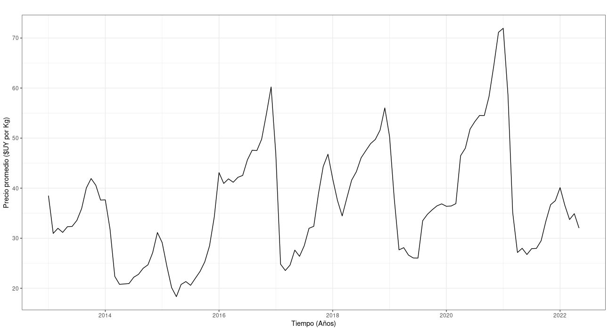
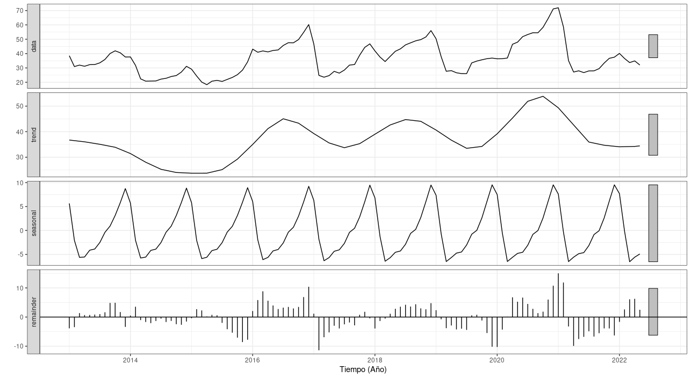

```{r setup, include=FALSE}
knitr::opts_chunk$set(echo = FALSE)
```


## Introducción

* Se busca modelizar empleando modelos SARIMA la serie de precios mayoristas de manzana que se comercian en la UAM.

* La serie original es bisemanal, se agregan para tener una serie mensual.

* Se tienen datos de 2013 a junio de este año.

* El desempeño predictivo fuera de la muestra es de particular interés.

## Descripción de la serie: Gráfico de la serie

{width=90%}

## Descripción de la serie: Descomposición de la serie

{width=90%}


## Identificación: ACF y PACF

{width=90%}

## Identificación: transformación logarítmica

* A simple esta transformación no parecería beneficiar el modelo.

* La transformación de Box-Cox nos lleva a concluir lo mismo.  


## Estimación: modelo manual


